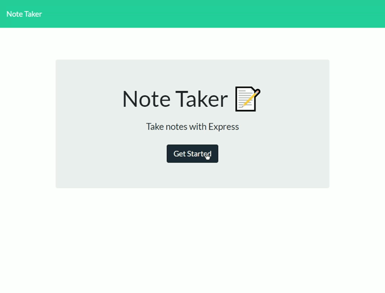

# NoteTaker

## Description 

Easy access to your notes from any device that has internet. Uses Express and JQuery to power the backend.

## Table of Contents
* [Description](#description)
* [Installation](#installation)
* [Usage](#usage)
* [License](#license)
* [Built With](#Built%20With)
* [Questions](#questions)

## Installation
Use `npm i` to install dependancies. 

## Usage
Access your notes from any device with internet to add, modify, and delete. Time and space saver too!

### Deployment

## License
The Unlicense - A license with no conditions whatsoever which dedicates works to the public domain. Unlicensed works, modifications, and larger works may be distributed under different terms and without source code.

## Built with 
* Javascript
* Jquery
* HTML
* Express
* Node.js

## Questions
If there are any questions please reach out to me on my Github [www.github.com/beki-g](www.github.com/beki-g)